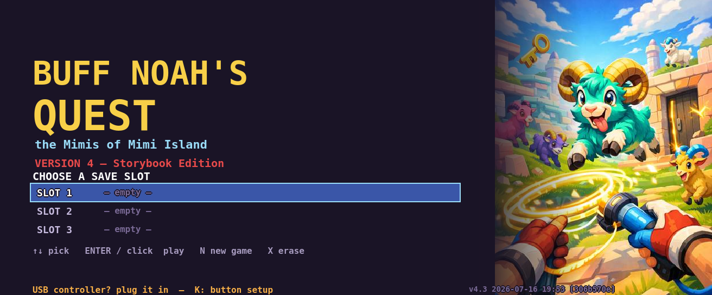
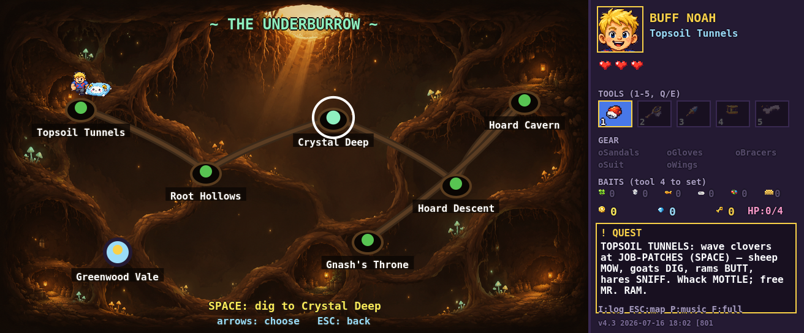
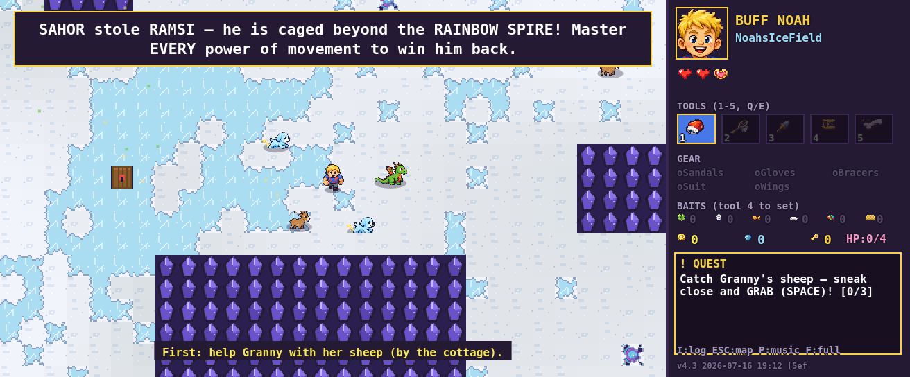

# Buff Noah's Quest — VERSION 4 (Storybook Edition)

A kid-friendly, Zelda-like pixel-art adventure built as a gift for Noah — starring **Buff Noah**
and **Ramsi**, his fiery clockwork-ram companion. Explore Mimi Island, befriend (never bonk!)
every creature, solve ability-gated puzzles, and rescue Ramsi from Mimi Sahor across four worlds:
Greenwood Vale, the Underburrow, Cogwerk City, and the stormy Grimspire finale.

## ▶ Play it now

**https://gryderart.github.io/BuffNoahsQuest/**

The whole game is a single self-contained HTML file — no install, no server, nothing to build.
You can also just download [`BuffNoahsQuest_v4.html`](BuffNoahsQuest_v4.html) and double-click it
(Chrome or Edge recommended). Saves live in your browser (3 slots).

## Controls

Arrows / WASD move. **Z** uses the current tool (net, harpoon…), **X** jumps, **C** asks Ramsi
for his current power (glow, shrink, bounce, glide, roll, decoy, ground-pound), **SPACE**
interacts and grabs, **I** opens YOUR PACK (capture log, gear, baits — arrow keys flip pages),
**ESC** opens the world map, **1–5** pick tools, **P** toggles music, **U** toggles the wetsuit,
**K** sets up a USB controller.

| The Underburrow overview | Noah's (wild!) Ice Field |
| --- | --- |
|  |  |

## For tinkerers

There is no bundler and no dependencies — plain JavaScript concatenated into one file:

- `src/NN_*.js` — the game, in load order (`00_boot` constants → `12_main` loop → worlds).
- `python3 build.py` — concatenates `src/`, embeds every `assets/*.png` as base64, and writes
  `BuffNoahsQuest_v4.html` + `game.js` (the same code the test harness loads).
- `python3 import_art.py` — the art pipeline: slices AI-generated sprite sheets from
  `assets/raw/` onto the game's pixel grid, snaps palette + outlines, writes `assets/`.
  `SHEET_PROMPTS.md` holds the exact prompts used to generate every sheet.
- `test/` — a Node harness (`npm i canvas`, then `NODE_PATH=... node test/smoke.js`): full
  playthrough, reachability validation for every map, puzzle solvers, and screenshot suites.
- `level_editor.html` / `map_editor.html` — the in-browser editors Noah uses to build custom
  levels (his Ice Field ships in `customlevels/`).
- `BOOTSTRAP.md` is the developer onboarding doc; `PROGRESS.md` is the full build diary.

## Credits

Designed by **Noah** (age 6) and his dad **Berkley Gryder**, with pixel art generated in ChatGPT
and code built alongside Claude. Made with love for the Gryder family — sheep are for hugging.
